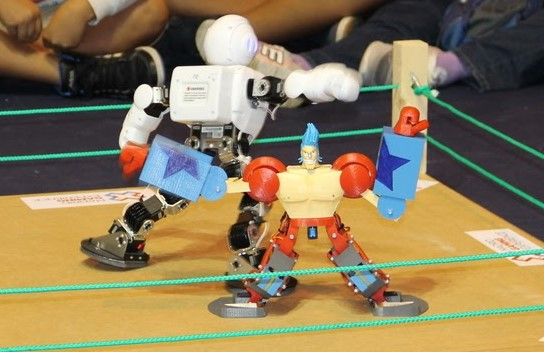
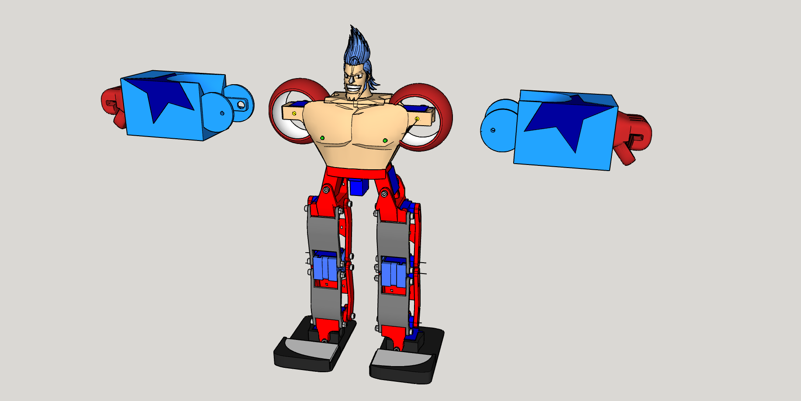
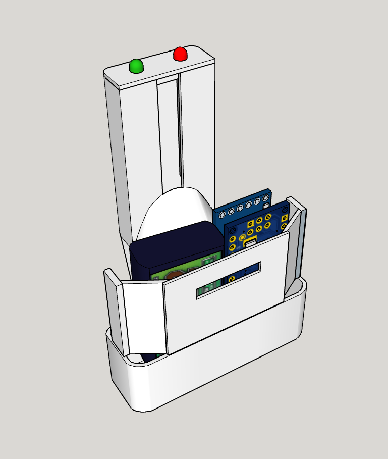

# MiniFrankyBot

Primer prototipo de robot humanoide realizado por OPRobots, buscando la estética y la ligereza para usar servos de bajo coste. Se controla mediante un mando de Nintendo 64 *hackeado* usando módulos bluetooth HC-05

## Robot

### Hardware
- Arduino Nano
- Driver de motores TB6612FNG
- 15x Servos SG90
- Controlador de servos PCA9685
- 2x LiPo 1S ~500 mAh
- Módulo Bluetooth HC-05
- Esqueleto completamente impreso en PLA

*Nota: hemos perdido el diseño que vinculaba los brazos con el torso, pero no sería dificil inferirlo a partir de las imágenes*

### Software
- Programado con VS-Code y PlatformIO
- Usa la librería [Octosnake](https://github.com/JavierIH/octosnake) creada por JavierIH para el control "suavizado" de los servos
- Hay disponibles programas de comprobación de pines, sin usar la PCA9685 y usando esta última

## Mando

### Hardware
- Arduino Nano
- Módulo bluetooth HC-05
- Lipo 2S 180mAh
- Estructura impresa en PLA que encaja en la ranura de expansión del mando de Nintendo 64

### Software
- Programado con VS-Code y PlatformIO
- Usa la libraría [N64Controller](https://github.com/pothos/arduino-n64-controller-library) para comunicarse con el mando
- Se conecta con el Robot usando módulos HC-05 en modo *master* <-> *slave*